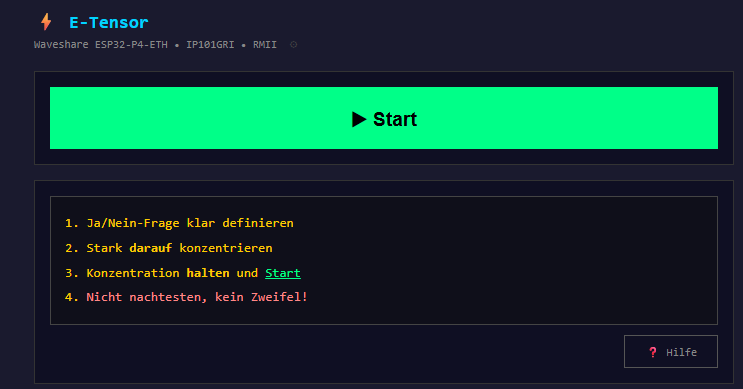
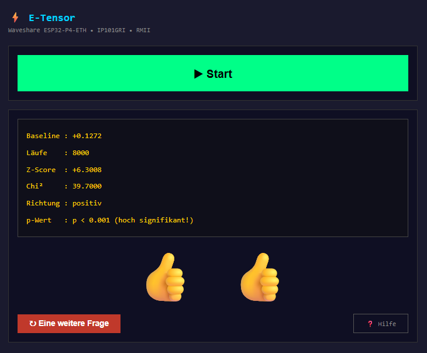

# etensor

**E-Tensor** ist ein auf dem **ESP32-P4** basierendes Gerät zur statistischen Analyse von Hardware-Zufallszahlen nach dem Vorbild des [Global Consciousness Projects (GCP)](https://grokipedia.com/page/Global_Consciousness_Project). Es misst, ob mentale Fokussierung einen messbaren Einfluss auf einen echten Hardware-Zufallsgenerator (TRNG) hat.

## Was es macht

Das Gerät liest kontinuierlich Rohwerte aus dem Hardware-TRNG des ESP32-P4 und wertet sie nach der GCP-Methodik aus:

- **Phase 1 – Baseline:** 100 Läufe zur Ermittlung des individuellen Rauschpegels
- **Phase 2 – Messung:** 8.000 Läufe à 50 Segmenten mit je 200 Bits
- **Auswertung:** Z-Score, Chi², Richtung und statistischer p-Wert
- **Ergebnis:** Sofortanzeige im Browser – von *nicht signifikant* bis *p < 0.001 (hoch signifikant!)*

Die Bedienung läuft vollständig über einen integrierten Webserver – keine App, kein Cloud-Dienst.

## Hardware

| Komponente | Details |
|---|---|
| Board | Waveshare ESP32-P4-ETH |
| PHY | IP101GRI via RMII |
| Verbindung | Kabelgebundenes Ethernet |
| Zufallsquelle | Hardware-TRNG (`0x501101A4`) |

## Software-Stack

- **ESP-IDF** (FreeRTOS, ESP-HTTP-Server, SPIFFS, NVS, mDNS)
- Webserver mit dynamisch gerenderten HTML-Seiten
- mDNS: Gerät ist automatisch als `etensor.local` erreichbar – keine IP-Suche nötig
- SPIFFS-Partition für statische Assets (Icons etc.)
- Eigene Partitionstabelle (`partitions.csv`)

## Projektstruktur

```
etensor/
├── main/
│   ├── etensor.c          # app_main, Systemstart
│   ├── etensor.h          # Typen, Konstanten, Deklarationen
│   ├── sensor.c           # TRNG-Zugriff & GCP-Analyse
│   ├── httpkram.c         # Ethernet, SPIFFS, Webserver, HTTP-Handler
│   ├── ha_push.c          # Home Assistant REST API Integration
│   ├── ha_push.h          # HA-Integration Interface
│   └── etensor_test.html  # Web-UI Vorlage
├── spiffs_image/          # Statische Dateien (wird geflasht)
├── partitions.csv         # Partitionstabelle
├── sdkconfig              # ESP-IDF Konfiguration
└── CMakeLists.txt
```

## Build & Flash

Entwicklung mit **VS Code + Espressif ESP-IDF Extension**:

| Aktion | Shortcut |
|---|---|
| Build + Flash + Monitor | `F3` |
| Nur Build | `Ctrl+Shift+B` |
| Nur Flash | `Ctrl+E F` |
| Monitor | `Ctrl+E M` |
| Menuconfig | `Ctrl+E G` |

> **Target:** `esp32p4` – niemals ein anderes Target verwenden!

## Screenshots

### Startbildschirm


### Ergebnis nach einer Messung


## Benutzung

1. Gerät per Ethernet verbinden und einschalten
2. Browser öffnen → **`http://etensor.local`** (keine IP-Suche nötig)
3. Eine mit Ja oder Nein eindeutig beantwortbare Frage formulieren – am besten aufschreiben.  
   Man darf keinerlei Vorurteil oder Erwartungshaltung haben: Ein „Ja" muss genauso akzeptabel sein wie ein „Nein".
4. **Maximal stark nur auf diese Frage konzentrieren!**  
   Konzentration halten, **▶ Start** drücken, Ergebnis abwarten (~5 Sekunden)
5. **„Eine weitere Frage"** für eine neue Messung

## Home Assistant Integration

Der E-Tensor lässt sich vollständig in **Home Assistant** einbinden – Messungen können vom HA-Dashboard aus gestartet werden, und die Ergebnisse werden automatisch als Sensoren übertragen. Kein MQTT-Broker, keine zusätzliche Software erforderlich.

### Voraussetzungen

- Home Assistant läuft im lokalen Netzwerk (HTTP, kein HTTPS erforderlich)
- E-Tensor und HA sind im selben Netzwerk


### Schritt 1 – E-Tensor konfigurieren

1. Browser öffnen → `http://etensor.local/config` (oder ⚙-Symbol neben dem Gerätenamen)
2. **Home Assistant URL** eingeben, z.B. `http://192.168.1.100:8123`
3. **Long-Lived Access Token** erstellen und einfügen:
   - HA → Profil (unten links) → Sicherheit → *Langlebige Zugriffstoken* → Token erstellen
4. **Speichern** drücken

### Schritt 2 – HA konfigurieren

Folgenden Block in die `configuration.yaml` von Home Assistant einfügen und HA neu starten:

```yaml
rest_command:
  etensor_start:
    url: "http://etensor.local/api/start"
    method: POST
    content_type: "application/json"
    payload: "{}"
```

### Schritt 3 – Dashboard-Karte anlegen

Den Inhalt von `ha_dashboard_cards.yaml` im HA-Dashboard über den Raw-Konfigurationseditor einfügen. Die Karte zeigt:

- **Start-Button** (nur sichtbar wenn keine Messung läuft)
- **„Messung läuft..."** Anzeige während der Messung
- **Ergebnis** (👍 / 👎) nach Abschluss
- **Detailtabelle** mit Z-Score, p-Wert, Richtung, Chi² und Baseline

### Sensoren in Home Assistant

Nach der ersten Messung erscheinen folgende Entitäten automatisch in HA:

| Entität | Beschreibung | Beispiel |
|---|---|---|
| `sensor.etensor_status` | Aktueller Status | `idle` / `running` / `done` |
| `sensor.etensor_result` | Ergebnis als Emoji | 👍 / 👍👍 / 👎 / 👎👎 |
| `sensor.etensor_zscore` | Z-Score der Messung | `+3.93` |
| `sensor.etensor_chisq` | Chi²-Wert | `15.44` |
| `sensor.etensor_direction` | Richtung | `positiv` |
| `sensor.etensor_pvalue` | Statistischer p-Wert | `p < 0.001 (hoch signifikant!)` |
| `sensor.etensor_baseline` | Baseline-Korrekturwert | `+0.17` |

Die Sensoren sind unter **Einstellungen → Geräte & Dienste → Entitäten** zu finden (nach „etensor" filtern).

> **Hinweis:** Die Entitäten erscheinen als „Nicht gruppiert" – das ist normal, da sie direkt über die REST API angelegt werden.
